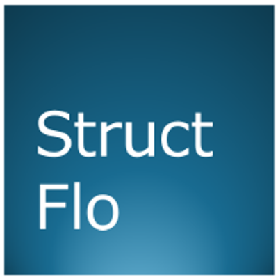

<div align="center">



**Open-source tools for early drug discovery, chemistry, and the life sciences.**

[](https://opensource.org/licenses/Apache-2.0)
[](https://www.python.org/downloads/)
[](https://github.com/structflo)

</div>

---


## Libraries

### [structflo-ner](https://github.com/structflo/structflo-ner)
**Zero-configuration Named Entity Recognition** for drug discovery, chemistry, and biological sciences.

Extracts compounds, targets, genes, diseases, bioactivities, and assays from scientific text using two complementary engines:

- **NERExtractor** — LLM-powered extraction via Gemini or local Ollama models, with contextual understanding for novel entities
- **FastNERExtractor** — Dictionary-based extraction using YAML gazetteers with exact, regex, and fuzzy matching (~393ms per abstract)

```python
from structflo.ner import NERExtractor

extractor = NERExtractor()
results = extractor.extract(abstract_text, profile="CHEMISTRY")
```

---

### [structflo-cser](https://github.com/structflo/structflo-cser)
**Chemical Structure Entity Recognition**  A Deep Learning detector for identifying compound panels and their matching labels/IDs in scientific documents.

Detects bounding boxes containing rendered chemical structures and their associated label IDs (e.g. `CHEMBL12345`) across PDFs and images and full-page documents.

```python
from structflo.cser.pipeline import ChemPipeline

pipeline = ChemPipeline()
results = pipeline.run("paper.pdf")
```

---

## License

Most structflo libraries are released under the [Apache License 2.0](https://opensource.org/licenses/Apache-2.0).
Please review individual repos for any exceptions. 
